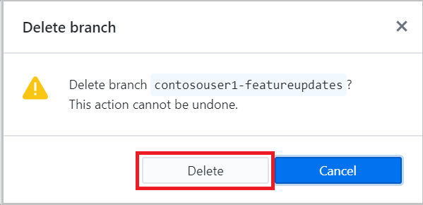

# Contribute content to the Microsoft Graph repository

To contribute to or edit content, you create a new branch from the Microsoft Graph repository. Do not use a fork because it adds complexity in the content review stage.

Most of the information in the sections of this topic can be found in [**GitHub Help**](http://help.github.com/) articles.

## Create a new branch

You can choose to create a new branch using the GitHub Desktop client for Windows, or you can use the Git Bash console to run commands on a command-line.

### Create a branch using the GitHub Desktop client

1.	Click the drop-down to the right of **Current branch**.

    

2. Enter a name for the new branch. To construct the name of the branch, specify your Github name, then hyphen, then any reasonable string that helps you identify the purpose of the branch. Select **Create new branch**. 

    

3. Verify that you are creating a new branch from the master branch, and then select **Create new branch**.

    

### Create a branch using Git commands

1. Open your Git Bash console.
2. Type `git pull origin master:<new branch name>` at the prompt. This creates a new branch locally that's copied from the latest `microsoft-graph-docs` master branch.
3. Type `git push origin <new branch name>` at the prompt. This will alert GitHub to the new branch. You should now see the new branch in your fork of the repository on GitHub.
4. Type `git checkout <new branch name>` to switch to your new branch.

## Add new content or edit existing content

You navigate to the repository on your local machine by using File Explorer. The repository files are in `C:\Users\<yourusername>\microsoft-graph-docs`.

To edit files, open them in an editor of your choice and modify them. To create a new file, use the editor of your choice and save the new file in the appropriate location in your local copy of the repository. While working, be sure to save your work frequently.

The files are a working copy of the new branch that you created in your local repository. Changing anything in this folder doesn't affect the local repository until you commit a change.

### Commit a change using the GitHub Desktop client

In the Changes pane, select **Commit to <branch name>**.


### Commit changes using Git commands

To commit a change to the local repository, type the following commands in your git console:

```
git add .
git commit -v -a -m "<Describe the changes made in this commit>"
```

The `add` command adds your changes to a staging area in preparation for committing them to the repository. The period after the `add` command specifies that you want to stage all of the files that you added or modified, checking subfolders recursively. (If you don't want to commit all of the changes, you can add specific files. You can also undo a commit. For help, type `git add -help` or `git status`.)

The `commit` command applies the staged changes to the repository. The `-m` parameter means you are providing the commit comment in the command line. The -v and -a switches can be omitted. The -v switch is for verbose output from the command, and -a does what you already did with the add command.)

You can commit multiple times while you are doing your work, or you can wait and commit only once when you're done.

## Submit a pull request to the main repository

When you're finished with your work and are ready to have it merged into master, follow these steps:

### Submit a pull request using the GitHub Desktop client

Select **Publish** for your current branch.


### Submit a pull request using Git commands

1. In your git console, type `git push origin <new branch name>` at the command prompt. This command pushes the current state of your new branch, including all commits made in the previous steps, to master.
2. On the GitHub site, to the new branch.
3. Select **Pull Request** at the top of the page.
4. Ensure that the Base branch is `microsoftgraph/microsoft-graph-docs@master` and the Head branch is `<your username>/microsoft-graph-docs@<branch name>`
6. Give your pull request a Title, and describe all the changes you're making. If your bug fixes a UserVoice item or GitHub issue, be sure to reference that issue in the description.
7. Submit the pull request.

After a branch is successfully merged (i.e., your pull request is accepted), don't continue working in the local branch that was successfully merged. This can lead to merge conflicts if you submit another pull request. Instead, if you want to do another update, create a new local branch.

## Delete a branch

After your changes are successfully merged into master, you can delete the branch you used because you no longer need it. Any additional work requires a new branch.

### Delete a branch using the GitHub Desktop client

1. In the top menu, select **Branch > Delete**.
2. Make sure of the branch you are deleting and then select **Delete**.

    

### Delete a branch using Git commands

1. In your git console type `git checkout master` at the command prompt. This ensures that you aren't in the branch to be deleted (which isn't allowed).
2. Next, type `git branch -d <branch name>` at the command prompt. This deletes the branch on your local machine only if it has been successfully merged to the upstream repository. (You can override this behavior with the `–D` flag, but first be sure you want to do this).
3. Finally, type `git push origin :<branch name>` at the command prompt (a space before the colon and no space after it). This deletes the branch on your github fork.
