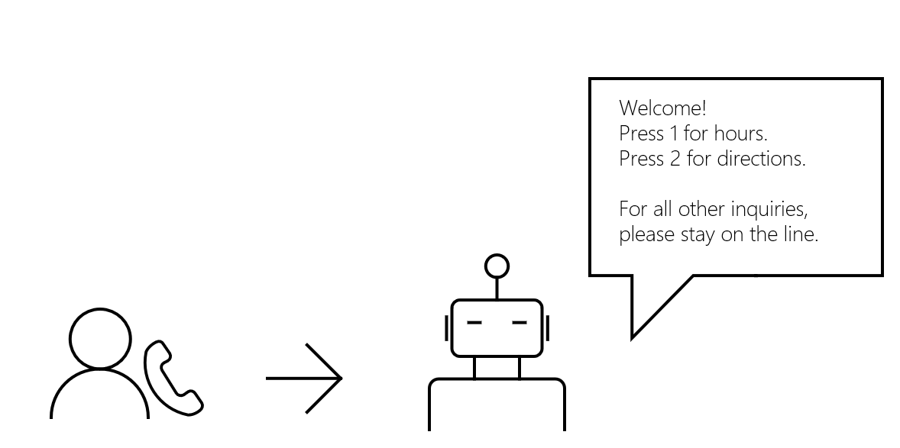

# Cloud Communications API Overview (preview)
The Cloud Communications APIs in Microsoft Graph add a new dimension to how your apps and services interact with users through various communications related features, such as calling and online meetings. Grow your business by expediting how you respond to your customers’ needs and how your employees collaborate with each other.

## Why Integrate with Cloud Communications APIs?

Discover the benefits of utilizing service applications ([bots](https://microsoftgraph.github.io/microsoft-graph-comms-samples/docs/articles/calls/register-calling-bot.html?q=create%20bot)) with our APIs.

### Handle Incoming Calls

It can be overwhelming at times when you're receiving a lot of calls for your business and it isn't possible, nor productive, to answer all of them. A bot can serve as your front-desk assistant and handle these calls by rejecting what seem like spam calls, and redirecting (forwarding) specific calls to a different number.

 **Learn how to create these scenarios:** 

Have a user [call a bot](/graph/api/application-post-calls) through VoIP.

Have a bot [redirect the incoming call](/graph/api/call-redirect) to the appropriate agent if necessary.

Have a bot [answer](/graph/api/call-answer) or [reject](/graph/api/call-reject) the call.

### Simplify the Customer Service Experience
Whether you own a large helpdesk service or a small storefront, it can be difficult to handle multiple customer requests, especially if you don’t have any context of what problem they’re trying to solve beforehand. Handle incoming calls from customers through an **Interactive Voice Response** (IVR) system, where a bot will initially interact with them.

When a customer is prompted for a response from the bot, the customer can press a key on their keypad that corresponds to their selection. The bot can then gather the dial-tone multi-frequency (DTMF) from the customer.

 **Learn how to create these scenarios:** 

Have a bot [answer a call](/graph/api/call-answer) from a customer.

Have a bot [play a prompt](/graph/api/call-playprompt) to inform and prompt a customer for a selection.

Have a bot [subscribe to a tone](/graph/api/call-subscribetotone) to gather the DTMF from a customer.

Have a bot [transfer a customer](/graph/api/call-transfer) to an agent.

Have a bot [end a call](/graph/api/call-delete) with a customer.

  

To create a more intelligent interaction between your customers and your bot, when a customer is prompted for a response, they will be able to directly speak about what they need help with.

Integrating with a natural language processing service means that the customer's speech can be analyzed for its sentiment. The bot can then respond to the customer's need accordingly.

>**Note:** You may NOT record or otherwise persist media content from calls or meetings that your application accesses, or data derived from that media content. Make sure you are compliant with the laws and regulations of your area regarding data protection and confidentiality of communications. Please see the [Terms of Use](https://docs.microsoft.com/en-us/legal/microsoft-apis/terms-of-use) and consult with your legal counsel for more information.

 **Learn how to create these scenarios:** 

Have a bot [answer a call](/graph/api/call-answer) from a customer.

Have a bot [play a prompt](/graph/api/call-playprompt) to inform and prompt the customer to speak.

Have a bot [record a short audio clip](/graph/api/call-record) of a customer speaking.

Have a bot [play a prompt](/graph/api/call-playprompt) with the appropriate response to the customer, after their speech is analyzed.

### Collaborate through Group Calls
Engage with your coworkers or customers by creating a group call. Let everyone contribute to the conversation.

 **Learn how to create these scenarios:** 

Have a bot [create a group call](/graph/api/application-post-calls#example-3-create-a-group-call-with-service-hosted-media) with multiple participants.

Have a bot [invite another bot or user](/graph/api/participant-invite) to an existing group call.

[Join an existing group call](/graph/api/application-post-calls#example-5-join-scheduled-meeting-with-service-hosted-media) as a bot.

Have a bot [list out the participants](/graph/api/call-list-participants) in the group call.

Have a bot [mute another participant](/graph/api/participant-mute).

### Send Reminders Reliably
If you want to send your customers a reminder for an appointment or a reminder for a payment deadline that’s approaching, you can have a bot call the customer automatically. <!--If the customer misses the call, it will leave a voicemail with the automated message. (Add this back once bot to PSTN calling works)-->

 **Learn how to create these scenarios:** 

Have a bot [call a customer](/graph/api/application-post-calls) on Teams.

Have a bot [play a recorded prompt](/graph/api/call-playprompt) to serve as a reminder.

Have the bot [end the call](/graph/api/call-delete).

### Set up Online Meetings
Whether you want to schedule a meeting between a doctor and a patient or between you and your direct reports, you'll be able to generate a meeting that you can rely on. For added flexibility, you'll be able to "dial out" to other users and invite them to the meeting while it's ongoing.

 **Learn how to create these scenarios:** 

Have a user [create an online meeting](/graph/api/application-post-onlinemeetings).

Have a user [retrieve the details](https://docs.microsoft.com/en-us/graph/api/onlinemeeting-get) of an online meeting

Have a bot or a user [join an online meeting](/graph/api/application-post-calls#example-5-join-scheduled-meeting-with-service-hosted-media)

## See Also
Learn about [Delegated and Application Permissions](https://docs.microsoft.com/en-us/azure/active-directory/develop/v1-permissions-and-consent) 
View and Manage [Permissions for Calls](/graph/permissions-reference#calls-permissions) 
View and Manage [Permissions for Online Meetings](/graph/permissions-reference#online-meetings-permissions)

## API Reference
[Communications API in Microsoft Graph beta](https://docs.microsoft.com/en-us/graph/api/resources/calls-api-overview?view=graph-rest-beta)

## Next Steps

Learn how you can [get started](cloud-communications-getting-started) with bots 
Learn more about [calls](cloud-communications-calls) 
Learn more about [media](cloud-communications-media) 
Learn more about [online meetings](cloud-communications-online-meetings) 

## Feedback
View our [Github Issues](https://github.com/microsoftgraph/microsoft-graph-comms-samples/issues) for all known issues 
